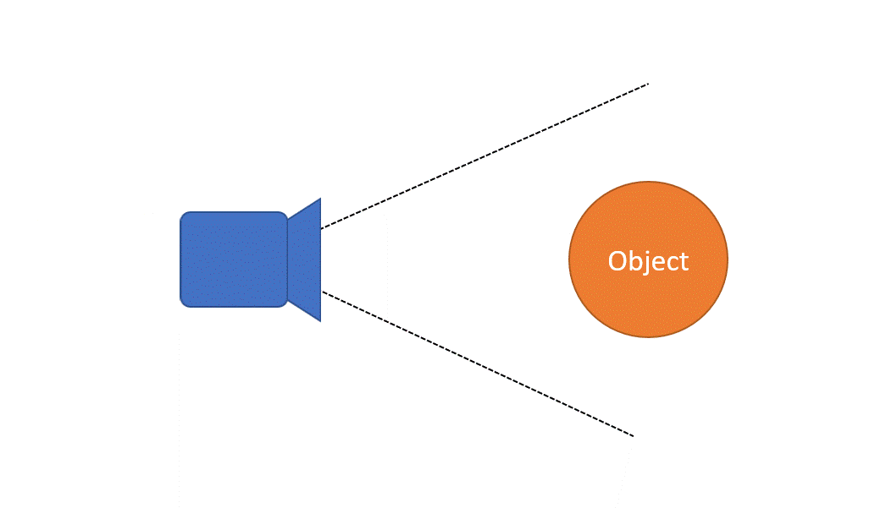
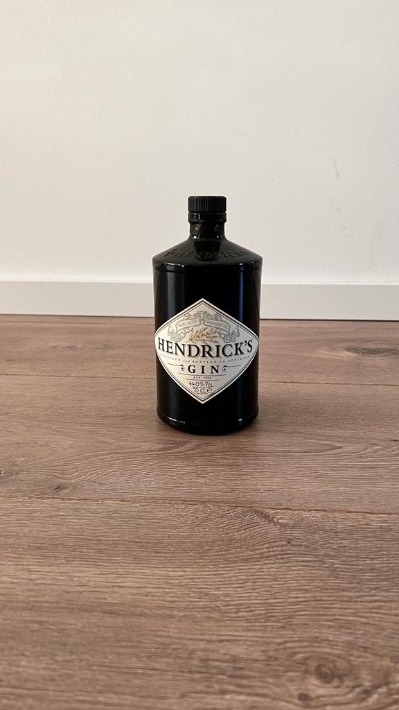

# Visual effects via monocular depth estimation
This repo contains scripts for visual effects for which point-wise depth estimation is necessary. Depth estimation is done via [Towards Robust Monocular Depth Estimation: Mixing Datasets for Zero-shot Cross-dataset Transfer](https://github.com/isl-org/MiDaS#towards-robust-monocular-depth-estimation-mixing-datasets-for-zero-shot-cross-dataset-transfer). Initially, only one visual effect is included, although the framework for other potential effects are given as well.

## Visual Effect #1: Camera translation + change of field of view
Camera moves closer to the object in the center of the frame; during the motion, field of view of the camera increases.

<table>
  <tr align="center">
    <td>effect</td>
    <td>input image</td>
     <td>generated animation</td>
  </tr>
  <tr>
    <td></td>
    <td></td>
    <td></td>
  </tr>
 </table>

## Clone the code
When cloning the code, please use the following command to also clone the submodules:
```
git clone --recursive https://github.com/berkanz/Visual-effects-via-monocular-depth-estimation.git
```

## Usage
Simply run animate.py scripts. 
```
python animate.py
```
Generated animation will be saved at /output subfolder.

<ins>Script options:</ins>
```
python animate.py --help
```

```            
  --gif_duration          total duration of output gif (in seconds)           [float]
  --gif_frame_rate        frame rate of output gif (in frames per second)     [int]
  --resolution            target resolution of output gif                     [list]
  --image_path            path to input image                                 [str]
  --output_path           save directory of output                            [str]
  --model_path            path to model weights                               [str]
  --save_pointcloud       save flag for generated point cloud                 [bool]                          
  --visualize_pointcloud  flag for visualizing point cloud                    [bool]        
```
